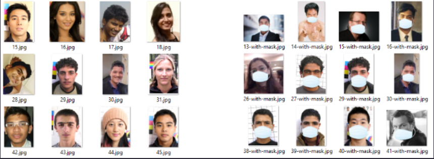
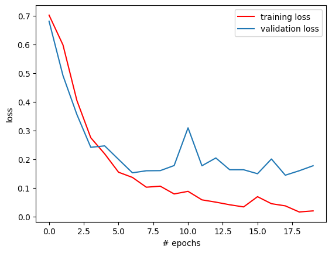
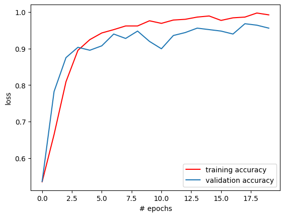

# Face Mask Detection
 

## 📌Description: 

 

### Face mask detection is a computer vision task to identify whether a person is wearing a face mask or not in images or videos, crucial for enforcing mask-wearing policies. 

  

The dataset consisted of `1376 images, 690 face images with masks and 686 without masks`. 

  

## 👀 ScreenShots

 

## ✍️ Authors

- [Abhiram Laha](https://github.com/Abhiram-Laha)

 
