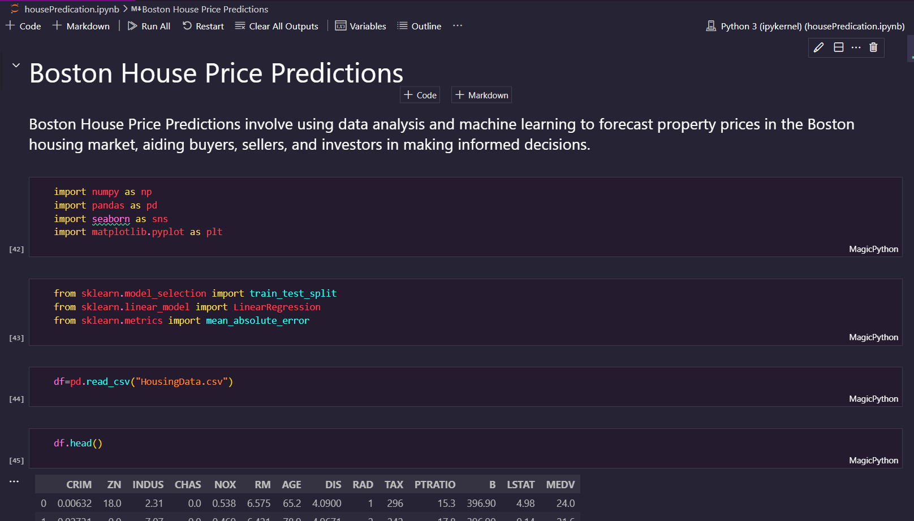
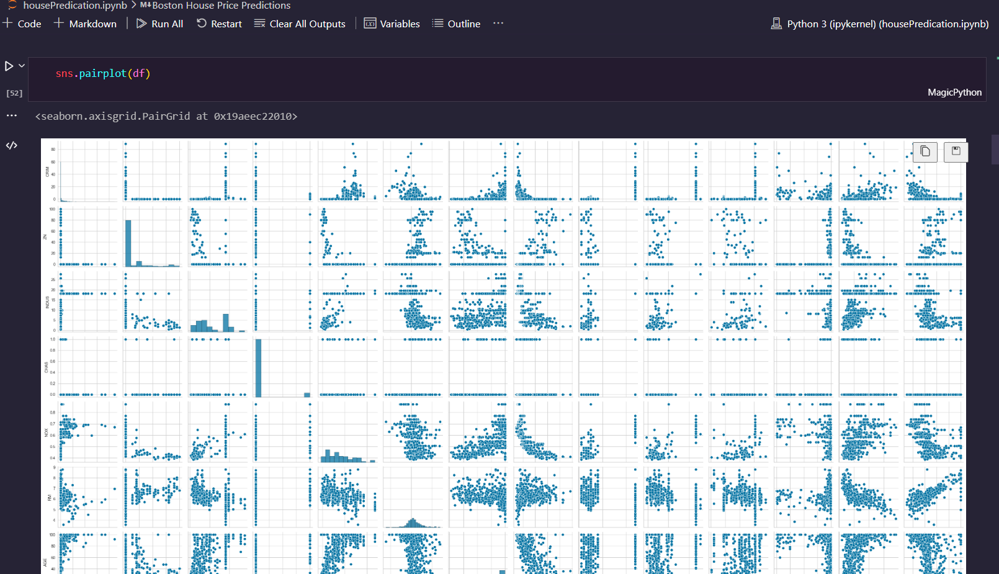
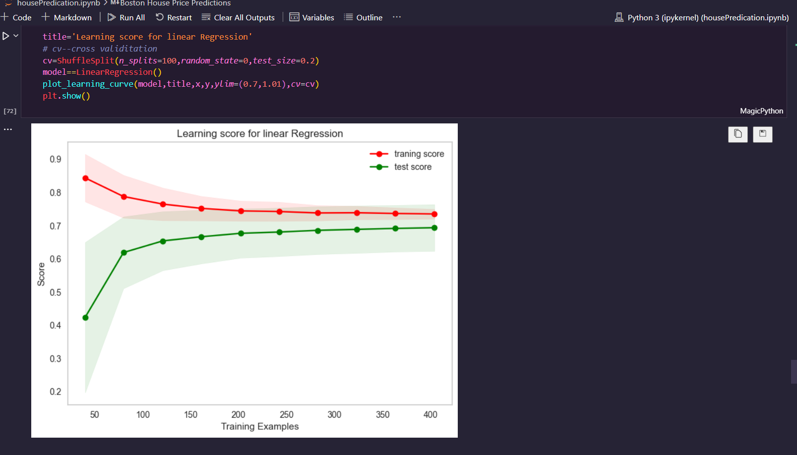

# Boston House Price Predictions
 

## 📌Description: 

 

### Boston House Price Predictions involve using data analysis and machine learning to forecast property prices in the Boston housing market, aiding buyers, sellers, and investors in making informed decisions.

 

The Boston housing dataset contains `506 observations and 14 variables`. The dataset contains missing values.

  

## 👀 ScreenShots

 

## ✍️ Authors

- [Abhiram Laha](https://github.com/Abhiram-Laha)

 
